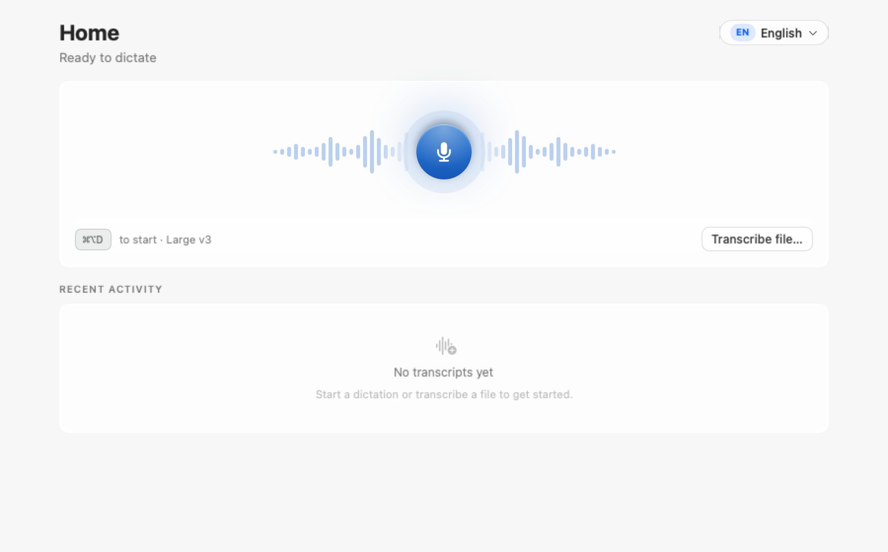
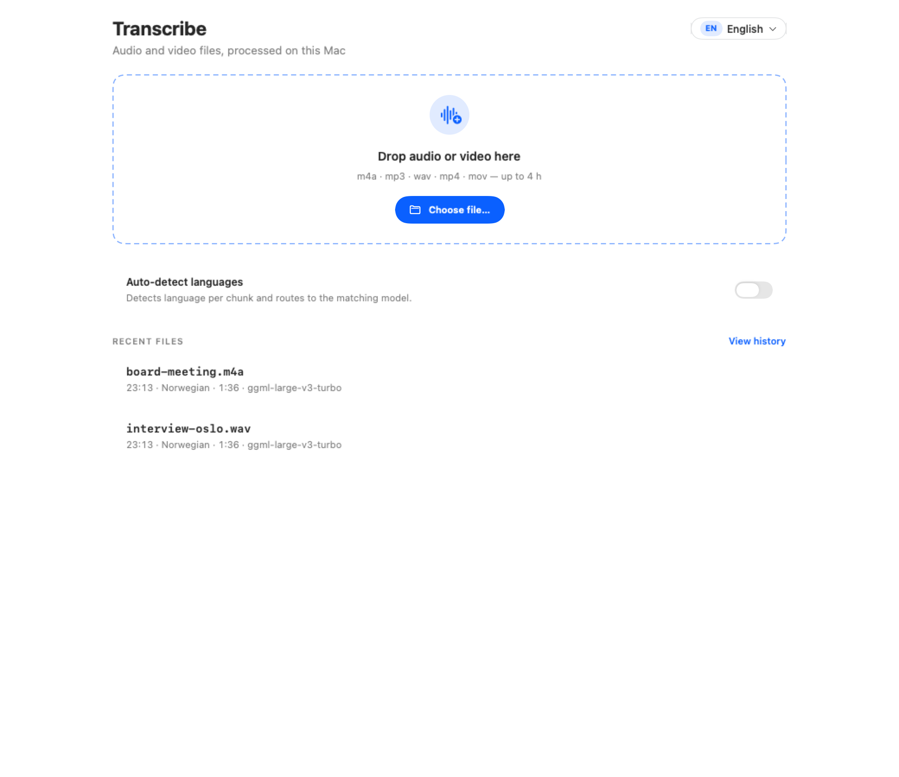

# Local Dictation & Local Capture

Two native macOS apps for turning speech into useful text. Choose **Local Dictation** for everyday voice typing, or **Local Capture** for recordings, meetings, and Day Logs.

**Apple Silicon (M1 or newer) | macOS 14 or newer**

<table>
<tr>
<td width="50%" valign="top">

### Local Dictation

**Speak instead of typing.**

- Dictate with a global shortcut or push-to-talk.
- Turn audio files into text.
- Keep recurring names and terminology in your vocabulary.

[**Download Local Dictation 1.0.28**](https://github.com/Christoffer91/chansen-apps-releases/releases/download/dictation-v1.0.28/MacLocalDictation-1.0.28-1028.dmg)

</td>
<td width="50%" valign="top">

### Local Capture

**Turn longer recordings into something you can review.**

- Transcribe recordings and meeting audio.
- Review speaker-aware transcripts.
- Use Day Log to capture and revisit your workday.

[**Download Local Capture 1.0.28**](https://github.com/Christoffer91/chansen-apps-releases/releases/download/dictation-v1.0.28/MacLocalCapture-1.0.28-128.dmg)

</td>
</tr>
</table>

[All releases](https://github.com/Christoffer91/chansen-apps-releases/releases) · [Release notes and checksums](https://github.com/Christoffer91/chansen-apps-releases/releases/tag/dictation-v1.0.28)

## A look inside

### Local Dictation

### File transcription

*Both screenshots show real Local Dictation views rendered offscreen with synthetic sample data or an empty state. They contain no personal recordings or transcripts. Illustrations use a development build; details may differ from the downloadable release.*

## Install and get started

1. Download the DMG for the app you want. You can install both.
2. Open the DMG and copy the app to **Applications**. Without administrator access, use your own `~/Applications` folder instead.
3. Open the copied app. Choose and download a local speech model when prompted; the initial model download needs an internet connection.
4. Allow microphone access for recording. Enable Accessibility access for Dictation's text insertion, or Screen Recording access for Capture features that need screen or system-audio capture, when requested.

The release apps are Developer ID signed and notarized by Apple. For download verification, use the `SHA256SUMS` file attached to the same release.

## Local processing and privacy

Local speech models can transcribe on your Mac after the model is downloaded. Optional cloud features send data to the provider you configure, so choose the processing mode that fits your needs. Review each app's **Privacy** settings for local history and recording retention controls.

## Updates

Use **Check for Updates** in the app, or download a newer version from [Releases](https://github.com/Christoffer91/chansen-apps-releases/releases). This repository hosts the download files and Sparkle update feeds for both apps.

The download links above point to the published **1.0.28** release.
